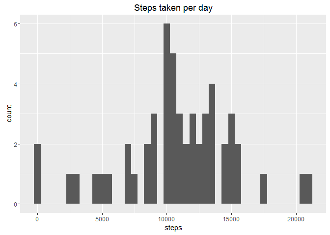
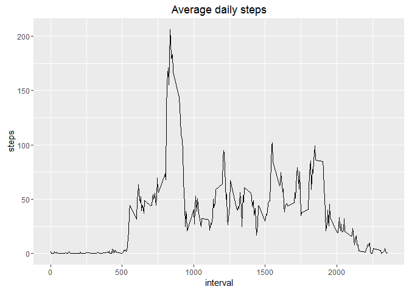
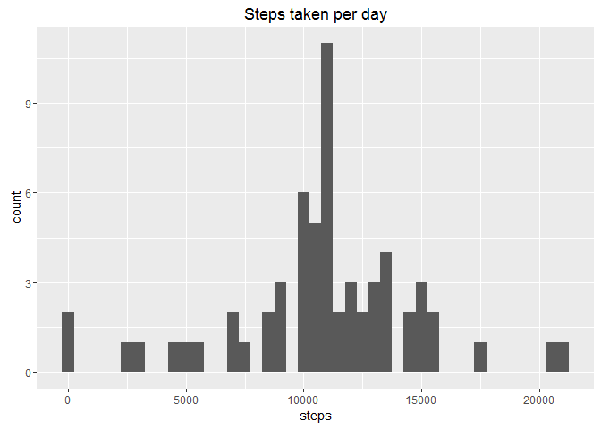
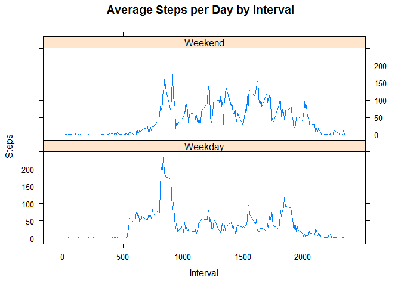

1. Loading and preprocessing the data
-------------------------------------

Unzip the data and load it in a data frame

``` r
unzip("activity.zip")
activitydata <- read.csv("activity.csv")
```

What is mean total number of steps taken per day?
-------------------------------------------------

Make a sum of all steps per day.

``` r
library(ggplot2)
StepsPerDay <- aggregate(steps ~ date, data = activitydata, FUN = sum)
qplot(StepsPerDay$steps, main = "Steps taken per day", xlab = "steps", 
      binwidth = 500)
```



``` r
rmean <- mean(StepsPerDay$steps)
rmedian <- median(StepsPerDay$steps)
```

The average is 1.076618910^{4} and the median is 10765

What is the average daily activity pattern?
-------------------------------------------

Calculate the average for the steps for each interval

``` r
stepsPerInterval<- aggregate(steps ~ interval, data = activitydata, FUN = mean)
qplot(stepsPerInterval$interval, stepsPerInterval$steps,
main = "Average daily steps", xlab = "interval",ylab = "steps", geom = "line")
```



``` r
selection <- max(stepsPerInterval$steps) == stepsPerInterval$steps
maxSteps <- stepsPerInterval$interval[selection]
```

The maximum steps are in this interval 835

Imputing missing values
-----------------------

How many missing values in the data frame

``` r
sapply(activitydata, function(x) sum(is.na(x)))
```

    ##    steps     date interval 
    ##     2304        0        0

Only in the steps column datas are missing. This missing values are replaced, with the steps per interval average.

``` r
imputed_data <- transform(activitydata, steps = ifelse(is.na(activitydata$steps), stepsPerInterval$steps[match(activitydata$interval,
                        stepsPerInterval$interval)], activitydata$steps))
imputed_dataDay <- aggregate(steps~ date, data = imputed_data, FUN = sum)
qplot(imputed_dataDay$steps, main = "Steps taken per day", xlab = "steps",
      binwidth = 500)
```



``` r
rimputmean <- mean(imputed_dataDay$steps)
rimputmedian <- median(imputed_dataDay$steps)
diffmean <- rimputmean - rmean
diffmedian <- rimputmedian - rmedian
```

The average is 1.076618910^{4} the median is 1.076618910^{4}

This makes an average difference from 0

This makes an median difference from 1.1886792

Are there differences in activity patterns between weekdays and weekends?
-------------------------------------------------------------------------

On weekdays there is a higher peak in the morning, in the weekend there is more overall activity.

``` r
weekdays <- c("Monday", "Tuesday", "Wednesday", "Thursday", 
              "Friday")
activitydata$EndOrDay <- as.factor(ifelse(is.element
                                         (weekdays(as.Date(activitydata$date))
                                                 ,weekdays)
                                         , "Weekday", "Weekend"))

stepsByInterval <- aggregate(steps ~ interval + EndOrDay, data = activitydata,
                             FUN = mean)
library(lattice)
xyplot(stepsByInterval$steps ~ stepsByInterval$interval|stepsByInterval$EndOrDay,
       main="Average Steps per Day by Interval",xlab="Interval", 
       ylab="Steps",layout=c(1,2), type="l")
```


